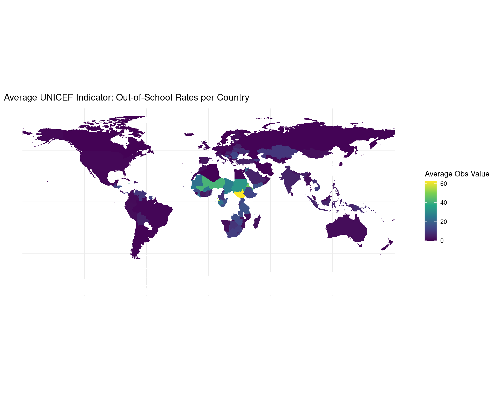
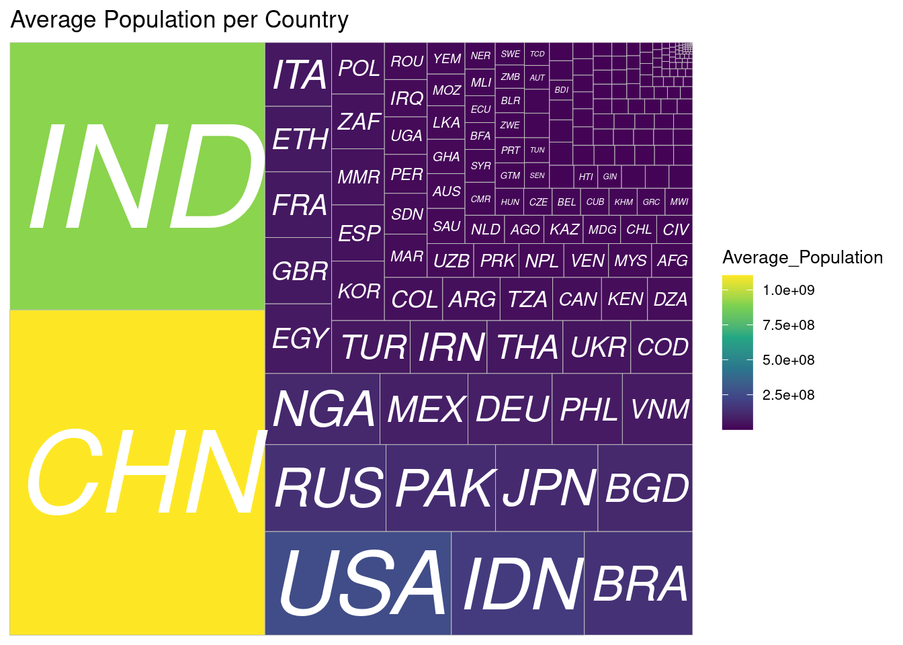
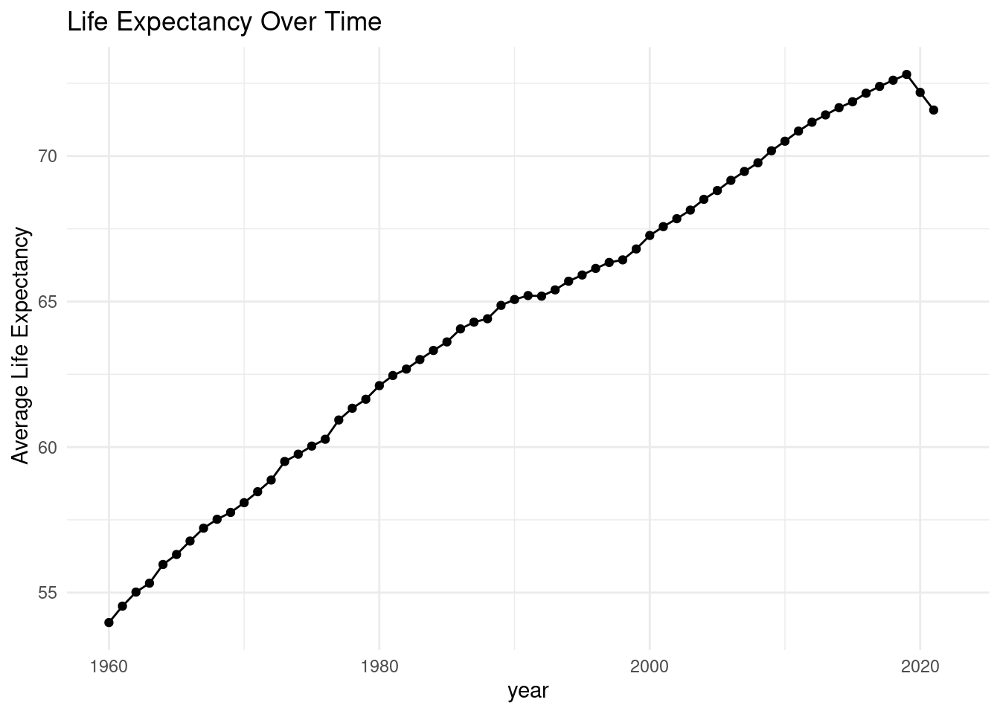
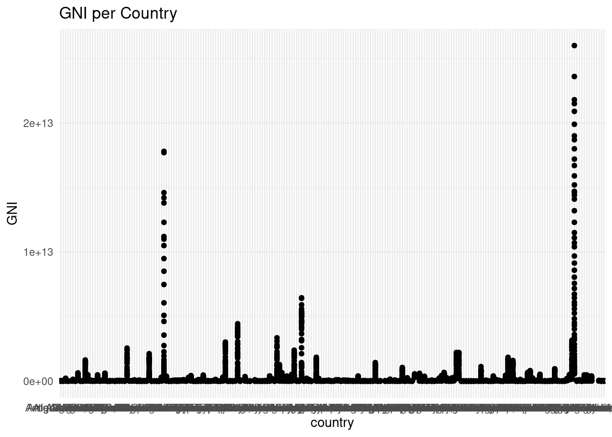

# AC584-Quarto-Assignment
<!DOCTYPE html>
<html xmlns="http://www.w3.org/1999/xhtml" lang="en" xml:lang="en"><head>

<meta charset="utf-8">
<meta name="generator" content="quarto-1.4.550">

<meta name="viewport" content="width=device-width, initial-scale=1.0, user-scalable=yes">

<meta name="author" content="Iarla Monaghan">
<meta name="dcterms.date" content="2024-04-10">

<title>Decades of Change: Tracking the Journey from Classrooms to Dreams - A Comparative Dashboard on the Out of School Rate (1900-2020)</title>

<link href="AC584-Quarto Assignment_files/libs/quarto-html/tippy.css" rel="stylesheet">
<link href="AC584-Quarto Assignment_files/libs/quarto-html/quarto-syntax-highlighting.css" rel="stylesheet" id="quarto-text-highlighting-styles">

<link href="AC584-Quarto Assignment_files/libs/bootstrap/bootstrap-icons.css" rel="stylesheet">
<link href="AC584-Quarto Assignment_files/libs/bootstrap/bootstrap.min.css" rel="stylesheet" id="quarto-bootstrap" data-mode="light">

</head>

<body class="fullcontent">

<main class="content" id="quarto-document-content">

<header id="title-block-header" class="quarto-title-block default">

<h1 class="title">Decades of Change: Tracking the Journey from Classrooms to Dreams - A Comparative Dashboard on the Out of School Rate (1900-2020)</h1>

    

    
Author

    

             
Iarla Monaghan 

          

  

    
    

    
Published

    

      
April 10, 2024

    

  

  
    
  

  

</header>

<section id="introduction" class="level1">
<h1>Introduction</h1>

This dashboard will tell a detailed story of how UNICEF indicators, specifically out-of-school rates of children during the 20th and 21st Centuries, have evolved. There will also be a comparison of the observation value to social and economic factors such as sex, population, and life expectancy. We aim to see the observation value reduced to zero by the end of this century. This visualization and analysis endeavor to illuminate the progress made so far and highlight the areas where more focused efforts are necessary to achieve our goal of universal education access.

<figure class="figure">

</figure>

</section>
<section id="caption" class="level1">
<h1>Caption</h1>

<strong>This map outlines the average observation value per country over the entire period being investigated. It can be seen that in the more economically developed countries, the observation value is lower and that in the less developed countries, the observation value is higher. By the end of this century, we need to see the observation value at zero so every child gets access to a proper education.</strong>

<figure class="figure">

</figure>

</section>
<section id="caption-1" class="level1">
<h1>Caption</h1>

This Bar Chart provides an outline of the observation value per the two sexes over the entire period under review. As would be expected the female sex has a higher out-of-school rate due to the old traditional values that a woman’s place is in the home as males would be the first choice for education. As previously mentioned we need to by the end of the century need to have an opportunity of all females have a proper education.

<figure class="figure">

</figure>

</section>
<section id="caption-2" class="level1">
<h1>Caption</h1>

This treemap shows each country’s average population over the entire period under review. As we have seen the less developed countries may have a high population but their out-of-school rate is still high. If we compare to Figure 1 the more economically developed countries have a high population and a low indicator rate and low economically developed countries have high populations and alarmingly high indicator rates.

<figure class="figure">

</figure>

</section>
<section id="caption-3" class="level1">
<h1>Caption</h1>

This time series shows the world’s life expectancy per year from 1960-2020. If we go pack figure 1 the observation value is decreased in modern times and I believe this has led to a higher life expectancy in this period. If a child is more educated they are more likely to livelonger because their county has better healthservice.

<figure class="figure">

</figure>

</section>
<section id="caption-4" class="level1">
<h1>Caption</h1>

This chart shows the GNI for 2015 per country over the period under review. If we go back to visualisation 1 we see that countries with very low GNI have a very alarmingly higher observation rate. The power of education in the growth of the economy is massive. Countries with high-class universities churn out graduates who demand higher wages which attracts foreign direct investment which increases government income which leads to better public services.

</section>
<section id="analysis" class="level1">
<h1>Analysis</h1>

The goal of this dashboard was to show that the out-of-school rate of children has decreased as a whole across the world. Yes, that is true on the raw data but there is a large amount of work to down in the less developed countries. If we go look at Figure 1 the map shows that particularly on the African Continent there is still a large average out-of-school rate. In Figure 2 we see that more females are not being given access to education which is a concern. Figures 3,4 + 5 are economic and social factors that show the power of the indicator. The population in Figure 3 shows once again the developed v developing countries concept we can see that the raw data is more alarming when we view the population of the high out-of-school rate countries. The life expectancy figure is used to show the power of education in modern times. The final GNI Visualisation is once again a sign of the power of education in the growth of an economy.

</section>
<section id="conclusion" class="level1">
<h1>Conclusion</h1>

In the end, the goal of this dashboard was to highlight both the power of education and the alarming number of children who do not get access to quality education. It is my firm belief that education is key to economic and social success which the figures and analysis of this dashboard have proven. “Mól an Oige agus tiocfaidh siad.” This is an Irish language proverb which states in English that if you praise the young they will follow which is apt for this indicator.

</section>

</main>
<!-- /main column -->

 <!-- /content -->

</body></html>
